# Aether

<p align="center"></p>

[](https://github.com/hemansubedi10/aether)
[](https://github.com/hemansubedi10/aether)
[](https://github.com/hemansubedi10/aether)
[](https://github.com/hemansubedi10/aether/actions)
[](https://nodejs.org)
[](https://github.com/hemansubedi10/aether/blob/main/LICENSE)

**An advanced, free, unlimited LLM CLI agent with multi-provider routing, automatic failover, and agentic tool use.**

Aether is a Claude Code / Kilo-class AI agent for your terminal. It unifies every model behind one interface — local Ollama models, OpenRouter free-tier, and any OpenAI-compatible endpoint — so you can switch models on the fly without changing your workflow. It runs fully local with **zero token limits and zero cost**, tracks provider health with a circuit breaker, and drives real tools (read, write, edit, glob, grep, bash, git, web search, and vision) in an agentic loop. No API keys required to get started.

## What is Aether?

<p align="center"></p>

Aether is a TypeScript CLI agent that turns your terminal into an autonomous coding assistant. At its heart is a **router** that keeps a priority-ordered list of providers and automatically fails over when one degrades. A **health tracker** opens a circuit breaker on repeated failures, so bad providers get skipped instead of blocking you. Everything streams through a ChatGPT-style TUI, and sessions, costs, checkpoints, and custom skills all persist on disk.

## Features

<p align="center"></p>

| Feature | Description |
|---------|-------------|
| ❤️ **Multi-provider routing** | One unified interface over Ollama, OpenRouter free-tier, and any OpenAI-compatible endpoint. Switch with `/model` and `/provider`. |
| ⚡ **Automatic failover** | If a provider throws, the router records the failure and moves to the next enabled provider. A single consolidated error is yielded only if every provider is down. |
| 🔒 **Circuit breaker health tracking** | Per-provider health state: failures, last check, circuit open/closed, and cooldown. `/providers` shows live status. |
| 🔧 **Agentic tool loop** | The model drives tools until it stops requesting them: `read_file`, `write_file`, `edit_file`, `list_dir`, `bash`, `glob`, `grep`, `web_search`, `vision`, and `git`. |
| 📝 **Streaming TUI** | A ChatGPT-style terminal interface with streaming output, conversation history, regenerate, and side-by-side model comparison. |
| 🧠 **Persistent memory** | Long-term memory stored on disk so the agent remembers you across sessions. |
| 🎯 **Plan / Yolo modes** | `--plan` for step-by-step approval, `--yolo` for autonomous execution. |
| 💰 **Token & cost tracker** | Per-provider, per-model request, input/output token counts, and estimated USD cost. `/cost` and `/reset-cost`. |
| 🏆 **Tournament arena with Elo** | Blind A/B voting between models with Elo ranking and a leaderboard. `/arena`. |
| ⚙️ **Custom slash commands (skills)** | Drop `.md` files in `~/.aether/skills/` to define reusable commands. `/skills` and `/skill <name>`. |
| ↺️ **Checkpoint / undo** | Snapshot file state before edits so you can roll back. |
| 💾 **Session persistence** | Save, load, list, and clear named sessions as JSON under `~/.aether/sessions/`. |

## Terminal Preview

```text
+- Aether --------------------------------------------------+
|                                                             |
|  ollama-local · qwen2.5-coder:7b                           |
|                                                             |
|  ? Build a REST API in Node.js with CRUD endpoints          |
|                                                             |
|  ? [tool: read_file] src/index.ts                           |
|  ? [tool: glob] src/**/*.ts                                 |
|  ? [tool: edit_file] src/index.ts                           |
|  ?                                                           |
|  Here's a complete REST API with CRUD endpoints...          |
|                                                             |
|  ? Created src/routes/users.ts                              |
|  ? Created src/routes/posts.ts                              |
|  ? Created tests/routes/users.test.ts                       |
|                                                             |
|  ? _                                                         |
+-------------------------------------------------------------+
```

One-shot mode:

```text
$ npx tsx src/index.ts "explain this repo"
Aether is a TypeScript CLI agent that turns your terminal into an
autonomous coding assistant. At its heart is a router that keeps a
priority-ordered list of providers and automatically fails over when
one degrades...
```

## Commands

| Command | Description |
|---------|-------------|
| `/help` | Show all available commands |
| `/model <name>` | Switch the active model |
| `/provider <name>` | Switch the active provider |
| `/models` | List all available models across providers |
| `/providers` | Show provider health status |
| `/session save [name] | load <name> | list | clear` | Manage sessions |
| `/arena` | Enter arena mode (compare models) |
| `/cost` | Show token usage and estimated cost summary |
| `/reset-cost` | Reset cost and token counters |
| `/settings [set <key> <value> | reset]` | View or modify settings |
| `/stats` | Show session stats, cost summary, and provider health |
| `/skills` | List available custom skills |
| `/skill <name> [args]` | Run a custom skill |
| `/connect <provider> <api_key>` | Connect an API key for a provider (saved to `~/.aether/keys.json`) |
| `/keys` | List which providers have API keys configured |
| `/disconnect <provider>` | Remove an API key |
| `/exit` (or `/quit`) | Exit the TUI |

## How It Works

Aether is three layers that talk to each other: your prompt flows from the CLI, through the Router, and out to whichever provider is best right now.

```
  Your Prompt
      v
  +-------------+
  |  Aether CLI  |  <- streaming TUI, tools, memory, arena
  +------^-------+
         v
  +-------------+
  |   Router    |  <- priority order, circuit breaker, automatic failover
  +------^-------+
    v v v v v
  +---+---+---+---+---+
  |Ollama|Groq|Gemini|Mistral|...|  <- 17 free providers
  +---+---+---+---+---+
```

- **CLI** -- the streaming TUI (`npx tsx src/index.ts`) plus the one-shot runner. It holds your tools, memory, sessions, and skills.
- **Router** (`src/router-engine.ts`) -- keeps a priority-ordered list of providers, runs a circuit breaker, and fails over automatically when one degrades. API keys live in the `KeyManager` (`src/keys.ts`).
- **Providers** -- local Ollama, OpenRouter free-tier, and any OpenAI-compatible endpoint. Each is wrapped behind one interface so the router never cares which one is speaking.

## Getting Started

```text
# One-line run (uses tsx, no install needed):
npx tsx src/index.ts "your prompt here"

# Or clone and run:
git clone https://github.com/hemansubedi10/aether
cd aether
npx tsx src/index.ts "hello world"

# Interactive TUI (Claude Code / ChatGPT style):
npx tsx src/index.ts
```

## Connect Cloud Providers

Cloud providers need an API key. Local Ollama works with no key, but cloud providers need free API keys. There are two methods:

```text
# Method A: environment variables (temporary, per-session)
export OPENROUTER_API_KEY="sk-or-..."
export GROQ_API_KEY="gsk_..."
npx tsx src/index.ts "ask groq something"

# Method B: /connect command (permanent, saved to ~/.aether/keys.json)
npx tsx src/index.ts /connect openrouter-free sk-or-...
npx tsx src/index.ts /connect groq gsk_...
npx tsx src/index.ts /keys        # list what's connected
```

## Free API Keys

You do not need a credit card for any of these:

- **OpenRouter** (openrouter.ai) — free tier, no card, many free models
- **Groq** (groq.com) — 1M tokens/day free
- **HuggingFace** (huggingface.co) — free inference API
- **Cohere** (cohere.ai) — free tier
- **Mistral** (mistral.ai) — free tier
- **DeepSeek** (deepseek.com) — pay-as-you-go, very cheap

Keys are stored locally in `~/.aether/keys.json` and are never uploaded.
